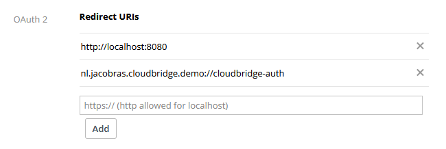

# ☁️ Dropbox

Start by instantiating the service:

```kotlin
val service = CloudBridge.dropbox()
```

Then, authenticate using the platform-specific methods below. Once authenticated,
the [shared API](../api/Overview.md) is available.

## Compatibility

=== "Path case insensitivity"

    Dropbox paths are [case-insensitive](https://www.dropbox.com/developers/documentation/http/documentation#case-insensitivity), meaning `/Folder/File.txt` and `/folder/file.txt` refer to the same file.

## Registration in App Console

!!! info

    Your app needs to be registered in 
    the [Dropbox App Console](https://www.dropbox.com/developers/apps).

    Make sure to register the redirect URIs there:

    

## Authenticating

=== "Android"

    --8<-- "docs/services/snippets/android.md"

=== "iOS"

    --8<-- "docs/services/snippets/iOS.md"

=== "Desktop"

    --8<-- "docs/services/snippets/desktop.md"

=== "Web"

    --8<-- "docs/services/snippets/web.md"