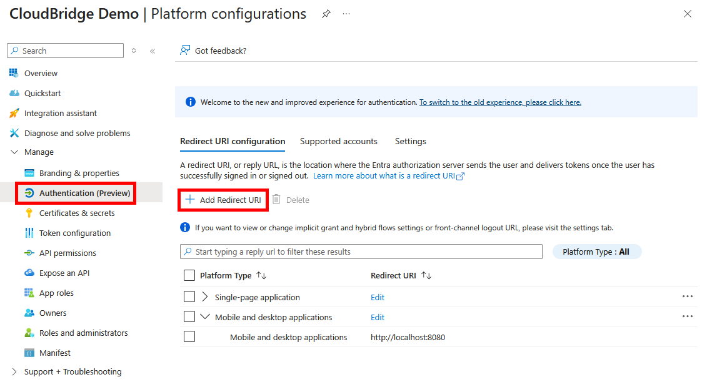

# ☁️ OneDrive

Start by instantiating the service:

```kotlin
val service = CloudBridge.oneDrive()
```

Then, authenticate using the platform-specific methods below. Once authenticated,
the [shared API](../api/Overview.md) is available.

## Registration in App Console

!!! info

    Your app needs to be registered in 
    the [Microsoft Azure Portal](https://portal.azure.com/#view/Microsoft_AAD_RegisteredApps/ApplicationsListBlade).

    Make sure to register the redirect URIs there:

    

    For web, choose _Single-page application_ as the platform.

## Authenticating

=== "Android"

    --8<-- "docs/services/snippets/android.md"

=== "iOS"

    --8<-- "docs/services/snippets/iOS.md"

=== "Desktop"

    --8<-- "docs/services/snippets/desktop.md"

=== "Web"

    --8<-- "docs/services/snippets/web.md"